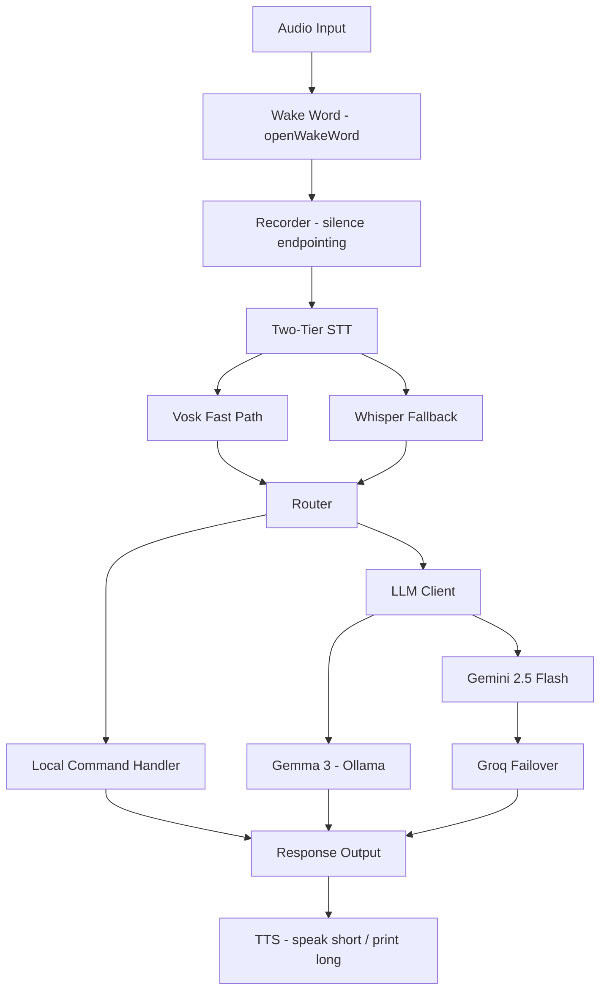

# M.Assist 🎙️

> A hybrid voice assistant with local-first LLM inference and silent cloud failover.

[](https://www.python.org/)
[](LICENSE)
[]()

M.Assist is a voice assistant built for low latency and zero-cost local
operation, with the option to fail over to cloud LLMs when needed. It runs
**Gemma 3 (4B) locally via Ollama** by default, and can transparently switch
to **Gemini 2.5 Flash → Groq** when configured for cloud mode.

Wake it with **"hey jarvis"**, speak a command or question, and it transcribes,
answers, and speaks the reply back — entirely on-device by default, with no
account or API key required to run the local path.

The project is built **stage by stage** — each stage is a self-contained,
testable milestone with its own smoke test. The commit history reflects this.

---

## ✨ Key Features

| Feature | Description |
|---|---|
| **Local wake word** | "hey jarvis" detection via openWakeWord — fully local, no access key, runs offline |
| **Two-tier STT** | Fast Vosk path with faster-whisper fallback triggered on low word-count or noisy audio |
| **Multi-backend LLM** | Local (Ollama/Gemma 3), Gemini 2.5 Flash, and Groq behind one interface |
| **Silent failover** | Cloud path steps down Gemini → Groq → local on rate limit or error |
| **Proactive rate limiting** | Sliding-window limiter skips a backend *before* hitting a 429 |
| **Offline TTS** | Spoken replies via pyttsx3 (system speech engine) — speaks short replies, prints long ones |
| **On-demand saving** | Say *"save that"* to write the last Q&A to its own Markdown file |
| **Config-driven** | Swap backends, models, and thresholds in `config.yaml` — no code changes |
| **Embedding-based routing** *(planned)* | `all-MiniLM-L6-v2` to classify local commands vs LLM queries |
| **Semantic caching** *(planned)* | Cosine-similarity cache to reuse answers to rephrased questions |
| **Real-time streaming mode** *(planned)* | Streaming Vosk + VAD for a sub-500ms cloud fast path |

---

## 🏗️ Architecture



---

## 📁 Project Structure

```text
M_Assist/
├── config.yaml                  # All tunable settings (backends, thresholds, audio, STT, TTS)
├── .env.example                 # API key variable names (copy to .env)
├── requirements.txt
├── models/                      # Vosk model (gitignored)
├── saved_conversations/         # Saved Q&A turns (gitignored)
└── src/
    └── m_assist/
        ├── cli.py               # Stage 0 smoke test (config + logging)
        ├── llm_cli.py           # Stage 1 smoke test (type a prompt, get a reply)
        ├── audio_cli.py         # Stage 2 smoke test (devices, meter, wake word)
        ├── stt_cli.py           # Stage 3 smoke test (record + transcribe)
        ├── run.py               # Entry point — the full assistant loop
        ├── assistant.py         # The bridge: wake → record → STT → LLM → TTS
        ├── storage.py           # On-demand conversation saving
        ├── core/
        │   ├── config.py        # YAML → dot-accessible config
        │   └── logger.py        # Console + rotating file logging
        ├── llm/
        │   ├── base.py          # LLMBackend abstract interface
        │   ├── rate_limiter.py  # Sliding-window RPM/RPD limiter
        │   ├── local_client.py  # Ollama / Gemma 3
        │   ├── gemini_client.py # Google AI Studio
        │   ├── groq_client.py   # Groq
        │   └── client.py        # Orchestrator + failover ladder
        ├── audio/
        │   ├── microphone.py    # sounddevice capture
        │   ├── wake_word.py     # openWakeWord listener
        │   ├── recorder.py      # silence-endpointed command capture
        │   ├── tts.py           # pyttsx3 text-to-speech
        │   └── stt/
        │       ├── vosk_stt.py      # fast path
        │       ├── whisper_stt.py   # faster-whisper fallback
        │       └── transcriber.py   # two-tier orchestrator
        └── routing/             # (Stage 5)
```

---

## 🚀 Getting Started

### Prerequisites
- Python 3.10+
- [Ollama](https://ollama.com) (for local inference)
- A [Vosk model](https://alphacephei.com/vosk/models) unzipped into `models/`

### Setup
```bash
git clone https://github.com/HarshaKoushikTeja/M_Assist.git
cd M_Assist
python -m venv venv
venv\Scripts\activate          # Windows  (use: source venv/bin/activate on macOS/Linux)
pip install -r requirements.txt
```

### Run the LLM in isolation (no mic, no keys)
```bash
ollama pull gemma3:4b
python -m src.m_assist.llm_cli
```

### Run the full voice assistant
```bash
# Ensure Ollama is running and a Vosk model is in models/
python -m src.m_assist.run
# then say "hey jarvis" and speak a question
```

### Use cloud backends (optional)
```bash
copy .env.example .env         # add your GEMINI_API_KEY and GROQ_API_KEY
# in config.yaml, set:  llm.backend: "cloud"
python -m src.m_assist.run
```

---

## 🗺️ Roadmap

- [x] **Stage 0** — Project scaffold, config system, logging
- [x] **Stage 1** — Multi-backend LLM client with failover & rate limiting
- [x] **Stage 2** — Audio capture + wake word (openWakeWord)
- [x] **Stage 3** — Two-tier STT (Vosk fast path + faster-whisper fallback)
- [x] **Stage 4** — Full voice loop (wake → STT → LLM → TTS) + on-demand saving
- [ ] **Stage 5** — Hybrid router (rules + embedding-based intent classification) & semantic cache
- [ ] **Stage 6** — Real-time mode: streaming Vosk + VAD + latency benchmarking

---

## 🛠️ Tech Stack

**Language:** Python 3.10+
**LLM:** Gemma 3 (Ollama), Gemini 2.5 Flash, Groq
**Wake word:** openWakeWord (ONNX, local)
**Speech-to-text:** Vosk, faster-whisper
**Text-to-speech:** pyttsx3
**Audio I/O:** sounddevice
**Planned:** sentence-transformers (routing), Silero/WebRTC VAD (streaming)

---

## 📄 License

MIT — see [LICENSE](LICENSE).

## 👤 Author

**Harsha Koushik Teja Aila**
[Portfolio](https://harshaaila.netlify.app) · [LinkedIn](https://www.linkedin.com/in/aila-harsha-koushik-teja) · [GitHub](https://github.com/HarshaKoushikTeja)
