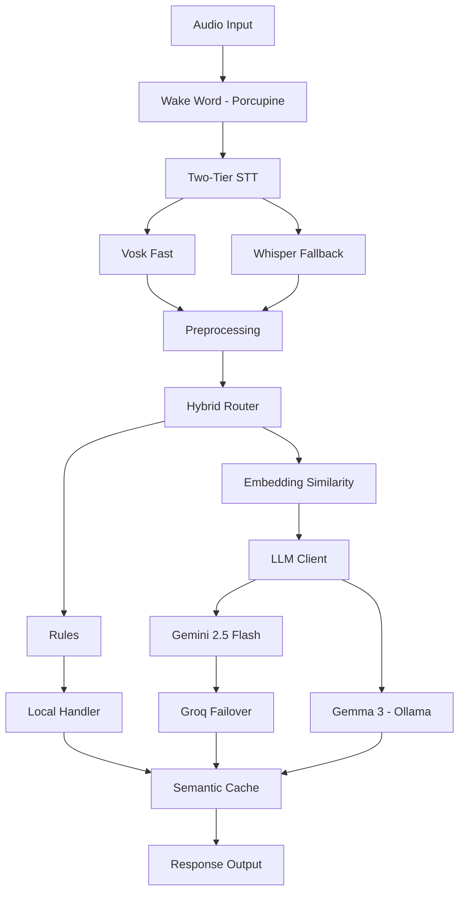

# M.Assist 🎙️

> A hybrid voice assistant with local-first LLM inference and silent cloud failover.

[](https://www.python.org/)
[](LICENSE)
[]()

M.Assist is a voice assistant built for low latency and zero-cost local
operation, with the option to fail over to cloud LLMs when needed. It runs
**Gemma 3 (4B) locally via Ollama** by default, and can transparently switch
to **Gemini 2.5 Flash → Groq** when configured for cloud mode.

The project is built **stage by stage** — each stage is a self-contained,
testable milestone with its own smoke test. The commit history reflects this.

---

## ✨ Key Features

| Feature | Description |
|---|---|
| **Multi-backend LLM** | Local (Ollama/Gemma 3), Gemini 2.5 Flash, and Groq behind one interface |
| **Silent failover** | Cloud path steps down Gemini → Groq → local on rate limit or error |
| **Proactive rate limiting** | Sliding-window limiter skips a backend *before* hitting a 429 |
| **Config-driven** | Swap backends, models, and thresholds in `config.yaml` — no code changes |
| **Two-tier STT** *(planned)* | Fast Vosk path with Whisper fallback on low-confidence audio |
| **Embedding-based routing** *(planned)* | `all-MiniLM-L6-v2` to classify local commands vs LLM queries |
| **Semantic caching** *(planned)* | Cosine-similarity cache to reuse answers to rephrased questions |

---

## 🏗️ Architecture



---

## 📁 Project Structure

```text
m_assist/
├── config.yaml              # All tunable settings (backends, thresholds, audio)
├── .env.example             # API key variable names (copy to .env)
├── requirements.txt
└── src/
    └── m_assist/
        ├── cli.py           # Stage 0 smoke test (config + logging)
        ├── llm_cli.py       # Stage 1 smoke test (type a prompt, get a reply)
        ├── core/
        │   ├── config.py    # YAML → dot-accessible config
        │   └── logger.py    # Console + rotating file logging
        ├── llm/
        │   ├── base.py      # LLMBackend abstract interface
        │   ├── local_client.py
        │   ├── gemini_client.py
        │   ├── groq_client.py
        │   └── client.py    # Orchestrator + failover ladder
        ├── rate_limiter.py  # Sliding-window RPM/RPD limiter
        ├── audio/           # Stage 2
        └── routing/         # Stage 4
```

---

## 🚀 Getting Started

### Prerequisites
- Python 3.10+
- [Ollama](https://ollama.com) (for local inference)

### Setup
```bash
git clone https://github.com/HarshaKoushikTeja/M.Assist.git
cd M.Assist
python -m venv venv
venv\Scripts\activate          # Windows  (use: source venv/bin/activate on macOS/Linux)
pip install -r requirements.txt
```

### Run locally (no API keys needed)
```bash
ollama pull gemma3:4b
python -m src.m_assist.llm_cli
```

### Run with cloud backends
```bash
copy .env.example .env         # add your GEMINI_API_KEY and GROQ_API_KEY
# in config.yaml, set:  llm.backend: "cloud"
python -m src.m_assist.llm_cli
```

---

## 🗺️ Roadmap

- [x] **Stage 0** — Project scaffold, config system, logging
- [x] **Stage 1** — Multi-backend LLM client with failover & rate limiting
- [x] **Stage 2** — Audio capture + Porcupine wake word
- [ ] **Stage 3** — Two-tier STT (Vosk + Whisper)
- [ ] **Stage 4** — Hybrid router + semantic cache
- [ ] **Stage 5** — Full assistant loop

---

## 🛠️ Tech Stack

**Language:** Python 3.10+
**LLM:** Gemma 3 (Ollama), Gemini 2.5 Flash, Groq
**Speech:** Vosk, Whisper, Porcupine *(planned)*
**ML:** sentence-transformers *(planned)*
**Audio:** sounddevice

---

## 📄 License

MIT — see [LICENSE](LICENSE).

## 👤 Author

**Harsha Koushik Teja Aila**
[Portfolio](https://harshaaila.netlify.app) · [LinkedIn](https://www.linkedin.com/in/aila-harsha-koushik-teja) · [GitHub](https://github.com/HarshaKoushikTeja)
